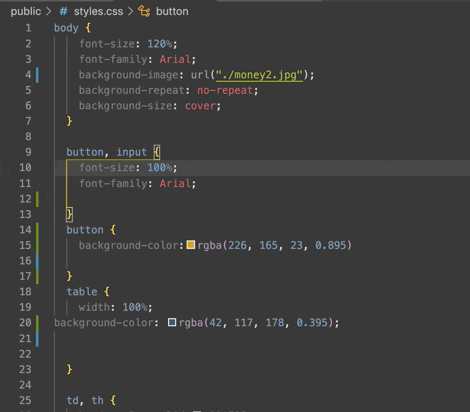

 


 

### :bar_chart: Table of Contents: 

* [Description](#Description)

* [Visuals](#Visuals)

* [Installation](#Installation)

* [Usage](#Usage)

* [Tools](#Tools)

* [Contributing](#Contributing)

* [Profile](#Profile)

* [License](#License)


 ### Description:

``` 
 Add functionality to our existing Budget Tracker application to allow for offline access and functionality.
 The user will be able to add expenses and  deposits to their budget with or without a connection. When entering transactions offline, they should populate the total when brought back online.
```

 **Offline Functionality:**

> Enter deposits offline 

> Enter expenses offline

> When brought back online:

>Offline entries should be added to tracker.

### Visuals:

  <br>
 


### Installation:

:computer: To deploy an application with a MongoDB database to `Heroku`, you'll need to set up a `MongoDB Atlas` account and connect a database from there to your application. Be sure to use the following guides for support:

- Set Up MongoDB Atlas

- Deploy with Heroku and MongoDB Atlas


### Usage:

:exclamation: `node server.js`


### Tools:

|  Technologies  | :floppy_disk:      |
---------------- | -------------------| 
MongoDB Compas   | HTML               |
MongoDB Atlas    | CSS                |
Mongoose         | Javascript         |       
Web-manifest     | Git Hub            |
node.js          | Terminal           |
Express          | Service-Worker     |
NPM              | Morgan NPM         |
JSON             | Visual Studio Code |
      

### Contributing:

:wave: Pull requests are welcome. For major changes,<br>
       Please open an issue first to discuss what you would like to change.<br>
       Please make sure to update tests as appropriate.


### Profile:

:octocat: [GitHub](https://github.com/adpir/Progressive-Budget)<br>

:purple_circle: [Heroku](https://stark-waters-65434.herokuapp.com/)


### License:

:copyright: [MIT](https://github.com/adpir/Progressive-Budget/blob/main/LICENSE) All rights reserved. :heart:
